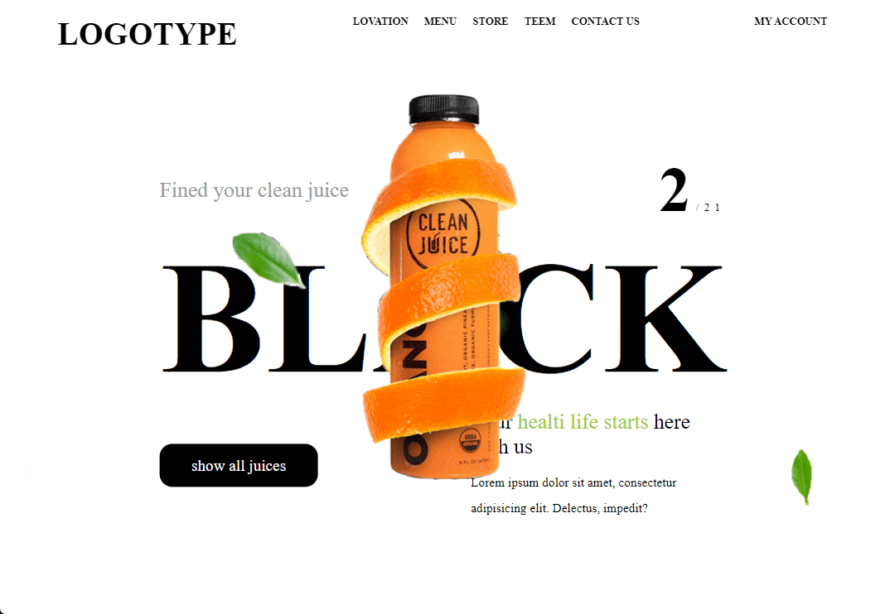

## Parallax

<div align="left">



#
## Проект сожержит
<details >
  <summary >Parallax js</summary>

  [Что это?](https://github.com/wagerfield/parallax#1-getting-started)

    Parallax Engine that reacts to the orientation of a smart device. Where no gyroscope or motion detection hardware is available, the position of the cursor is used instead.

    Check out the demo to see it in action!

</details>
<details >
  <summary >TweenMax js</summary>
 
  [Что это?](https://greensock.com/tweenmax/) 

    TweenMax lets you animate literally any property of any object that JavaScript can touch (CSS, SVG, React, Vue, Three.js, canvas, motion paths, generic objects, etc.). Before the release of GSAP 3, TweenMax was the most feature-packed (and popular) animation tool in the GSAP arsenal. However in GSAP 3, you no longer even need to reference TweenMax in your code (although you can because GSAP 3 honors the vast majority of legacy code). We strongly recommend migrating to GSAP 3's streamlined syntax. 
</details>

<details>
  <summary>SCSS</summary>
 
  [Что это?](https://sass-scss.ru/)  

    Вы можете изменять  настройки в вашем проекте. 
    Для  автоматического комполирования файлов css необходимо запустить 

  Live Sass Compiler 

  [Что это?](https://marketplace.visualstudio.com/items?itemName=ritwickdey.live-sass)  

</details>

<details>
  <summary>Локальный сервер</summary>
 
  [Что это?](https://ru.wikipedia.org/wiki/Localhost) 
 
  По умолчанию [localhost:8080](http://localhost:8080).
</details>


# 
## Для запуска потребуется
- этот репозиторий 
 ```
git clone https://github.com/VladislavBobyrev/parallax
```
- node.js 
 
```
https://nodejs.org/en/
```

- Live Sass Compiler

 
```
https://marketplace.visualstudio.com/items?itemName=ritwickdey.live-sass
```

- браузер


#
## Связвться со мной
<div align='center'> 
 
 ```
vladislavbobyrev@yandex.ru
```
 
 [](https://t.me/VladislavBobyrev)

 </div>
 
<div align="center">
  <h2>**ВНИМАНИЕ!**  Вся конфигурация является открытой. </h2>
 
**ВНИМАНИЕ!** На компьютере должны быть установлены программы `node` и `npm`.
Генерация  занимает много времени за счёт
установки `node_modules`. Необходимо дождаться окончания этого процесса.
 
</div>
